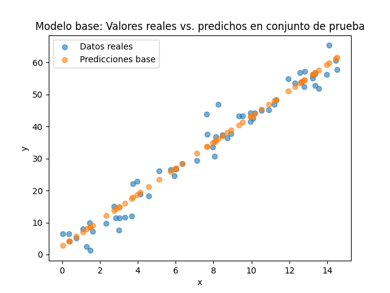
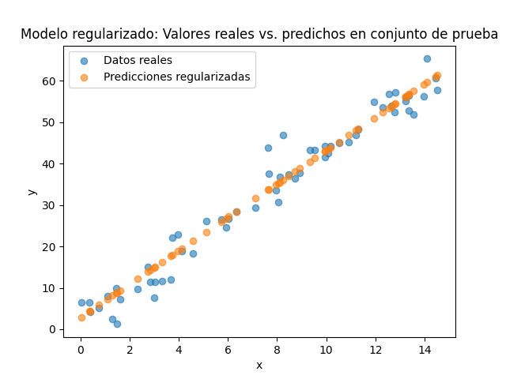
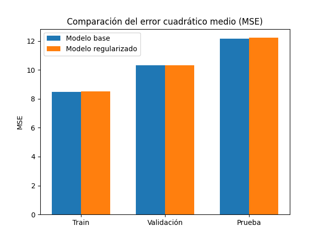
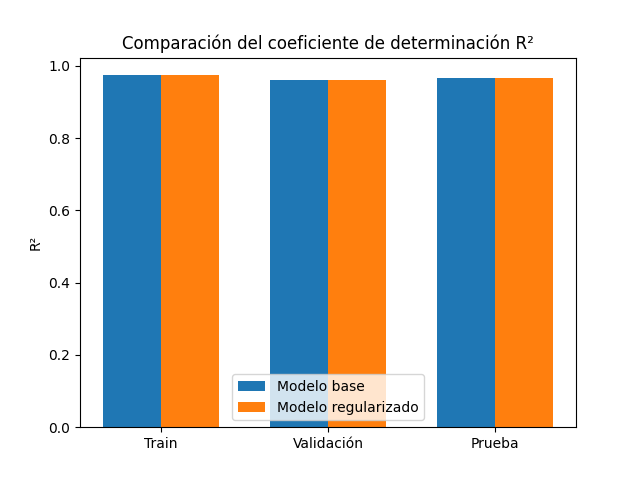

# Análisis del desempeño del modelo de regresión lineal con descenso de gradiente

Este reporte analiza el rendimiento de una implementación manual de regresión lineal simple entrenada mediante descenso de gradiente.  Se seleccionó la versión mejorada del script **`regresion_lineal_gd_mejorado.py`**, que implementa las funciones de entrenamiento y cálculo de métricas desde cero.  El objetivo del análisis es evaluar cómo se comporta el modelo en un conjunto de datos sintético, diagnosticar su grado de sesgo y varianza, determinar el nivel de ajuste (underfitting/overfitting) y explorar si la regularización mejora su desempeño.

## Conjunto de datos y división Train/Validation/Test

Para este estudio se generó un conjunto de 300 muestras sintéticas siguiendo la relación lineal:

\[\;y = 3 + 4x + \varepsilon\;\]

 donde \(x\) se distribuye uniformemente en el intervalo \([0, 15]\) y \(\varepsilon\) es ruido gaussiano con desviación estándar igual a 3.  Este tipo de datos permite evaluar si el modelo recupera la tendencia lineal subyacente en presencia de ruido.

El conjunto se dividió aleatoriamente en tres partes: 60 % para entrenamiento, 20 % para validación y 20 % para prueba.  La división **Train/Validation/Test** permite entrenar el modelo, ajustar hiperparámetros con el conjunto de validación y evaluar el rendimiento final en datos no vistos (prueba).

## Entrenamiento del modelo base

Se entrenó un modelo de regresión lineal simple utilizando descenso de gradiente.  Se inicializaron los pesos en cero y se actualizó la función de pérdida (error cuadrático medio) durante 15 000 iteraciones con una tasa de aprendizaje de 0,005.  Tras el entrenamiento se calcularon las predicciones y se midieron el error cuadrático medio (MSE) y el coeficiente de determinación (R²) en cada subconjunto.

El modelo base obtuvo los siguientes resultados:

| Conjunto      | MSE           | R²             |
|--------------|--------------|---------------|
| Entrenamiento| 8.49         | 0.974         |
| Validación   | 10.32        | 0.961         |
| Prueba       | 12.16        | 0.965         |

Las métricas MSE reflejan el tamaño medio de los errores; el valor de 8,49 en entrenamiento es cercano a la varianza del ruido (≈9), lo que indica que el modelo captura adecuadamente la relación subyacente.  Los valores de R² cercanos a 1 muestran que se explica más del 96 % de la varianza de los datos.

## Diagnóstico de sesgo y varianza

El **sesgo** mide la incapacidad del modelo para representar la verdadera relación en los datos debido a supuestos erróneos o excesivamente simples.  Según la bibliografía, un sesgo alto implica que el modelo produce predicciones sistemáticamente erróneas y conduce a un **underfitting**, mientras que un sesgo bajo indica que el modelo se ajusta bien a la tendencia real【648057569911820†L343-L348】.  

El **sesgo** del modelo base se considera **bajo** porque la relación real es lineal y la implementación recupera correctamente la pendiente y el intercepto (pendiente ≈ 4, intercepto ≈ 3).  El MSE en el conjunto de entrenamiento es similar a la varianza del ruido, lo cual sugiere que el modelo no sufre underfitting.

La **varianza** refleja la sensibilidad del modelo a pequeñas fluctuaciones en los datos de entrenamiento; una varianza alta produce sobreajuste al memorizar variaciones del conjunto de entrenamiento【648057569911820†L343-L348】.  En este caso, las métricas entre los conjuntos de entrenamiento, validación y prueba son similares (diferencias de ~3–4 unidades en MSE), por lo que se estima una **varianza media**.  No se observa un incremento drástico del error en validación o prueba, por lo que el modelo no parece sufrir overfitting severo.

### Nivel de ajuste

Considerando los resultados anteriores, el nivel de ajuste del modelo se clasifica como **fitted** (adecuado).  No hay indicios de **underfitting** porque el sesgo es bajo, y tampoco se detecta **overfitting** significativo porque la varianza es moderada y el desempeño se mantiene estable al pasar de entrenamiento a prueba.  El modelo recupera correctamente la estructura lineal y generaliza razonablemente bien.

## Regularización y ajuste de parámetros

Para explorar si es posible mejorar el rendimiento, se probó una versión regularizada del modelo añadiendo un término L² (ridge) al descenso de gradiente.  La regularización agrega un término de penalización al gradiente proporcional a los pesos, lo que suaviza el modelo y busca reducir la varianza en los datos【648057569911820†L443-L444】.  Se seleccionó una tasa de regularización \(\lambda=0{,}1\) y se mantuvieron las demás configuraciones.

La siguiente tabla resume las métricas del modelo regularizado y las compara con el modelo base:

| Conjunto      | MSE base | MSE regularizado | R² base | R² regularizado |
|--------------|---------:|-----------------:|--------:|----------------:|
| Entrenamiento| 8.49     | 8.50            | 0.974   | 0.974           |
| Validación   | 10.32    | 10.33           | 0.961   | 0.961           |
| Prueba       | 12.16    | 12.22           | 0.965   | 0.965           |

Las diferencias entre ambos modelos son mínimas.  Esto se debe a que la varianza del modelo base ya es relativamente baja; la regularización apenas modifica los pesos y, en consecuencia, los errores y los R² se mantienen casi iguales.  Los gráficos de dispersión de las predicciones frente a los valores reales muestran patrones muy similares:

Asimismo, los diagramas de barras comparando el MSE y el R² en los tres conjuntos evidencian que la regularización no cambia sustancialmente las métricas:

Aunque en este ejemplo la regularización no mejora de forma apreciable el desempeño, su inclusión es recomendable cuando se observa un aumento del error al pasar de entrenamiento a validación o prueba.  Ajustar \(\lambda\) mediante validación cruzada o incrementar el tamaño del conjunto de datos podrían ayudar a reducir la varianza en casos más complejos.

## Conclusiones

La implementación manual de regresión lineal con descenso de gradiente demostró un buen desempeño en un conjunto de datos sintético.  La división Train/Validation/Test permitió estimar la capacidad de generalización y calcular métricas objetivas.  El modelo base presentó **bajo sesgo**, **varianza media** y un nivel de ajuste **adecuado**, lo que indica que recupera correctamente la relación lineal y generaliza bien.  La regularización L² apenas modificó los resultados debido a la baja varianza inicial; esto pone de manifiesto que las técnicas de regularización tienen mayor impacto cuando el modelo se sobreajusta a los datos de entrenamiento【648057569911820†L443-L444】.

En aplicaciones futuras se recomienda experimentar con conjuntos de datos más grandes o reales, ajustar automáticamente la tasa de aprendizaje y el número de iteraciones y explorar otras técnicas de regularización o normalización de características para optimizar aún más el rendimiento del modelo.
